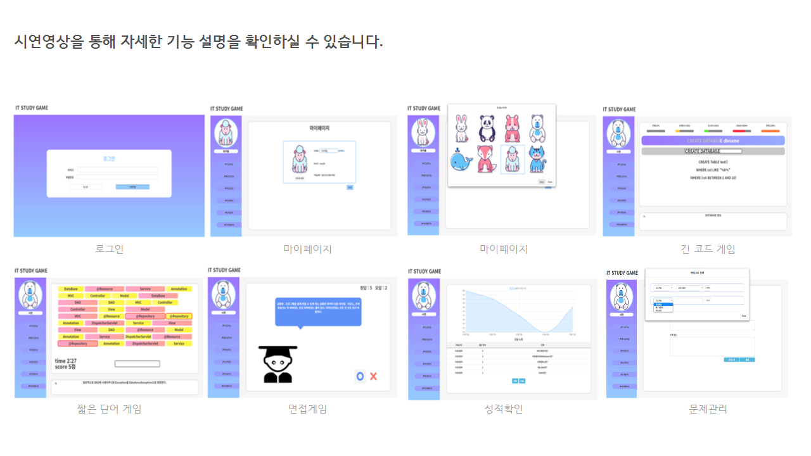
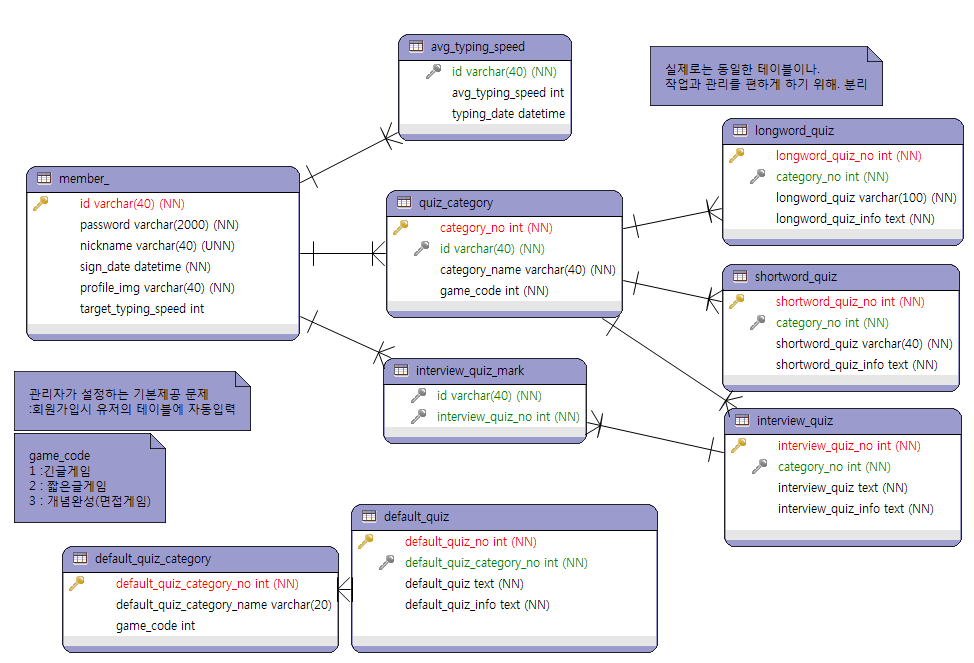

:skull: **옛날 코드 주의**

# ItStudyGame

IT 를 주제로 한 3종 게임, 긴 코드 타자 연습, 짧은 단어 타자 연습, 인터뷰 문제 들로 구성되어 있습니다.    
각 게임의 문제마다 미리 입력해 놓았던 문제에 대한 설명을 바로 확인 할 수 있는 편의기능을 제공합니다.  
처음 개발공부를 시작할 때 바닐라 자비스크립트로 만들었던 게임을 후에
Spring 과 MySQL을 적용하여 업그레이드한 의미 있는 프로젝트 입니다.

## Stack

Language : Java , JavaScript, Html5, Css3, SQL   
Service System : Spring4, MyBatis, Apache Tomcat  
Database : MySQL8.0  
Tool : Eclipse, Workbench, ERMaster  
형상관리 : Git/GitHub  
배포 :Amazon Web Service(EC2, RDS, ROUTE53)

## 결과화면

:movie_camera: **[시연영상 바로가기 클릭(2분 17초 시작)](https://www.youtube.com/watch?v=S76dEhq3IyE#t=2m17s)**

## ERD

